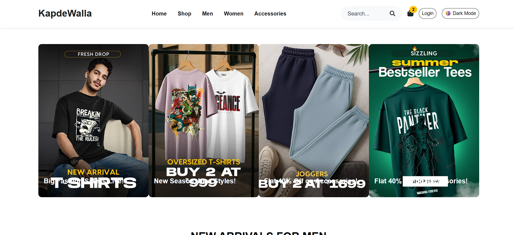
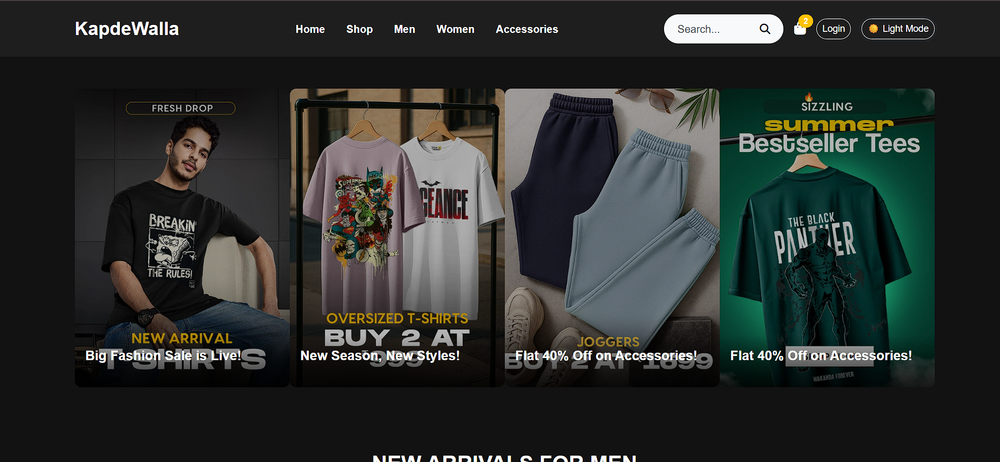

# 👕 KapdeWalla – Static Fashion Website

A modern, responsive e-commerce homepage designed with semantic HTML, custom CSS, and Bootstrap 5. This project replicates a real-world fashion storefront layout featuring campaign sliders, animated product displays, interactive modals, and dark mode support — all without a backend!

---

## ✨ Features

- ✅ Semantic HTML5 structure
- ✅ Fully responsive design using Bootstrap 5
- ✅ Horizontal campaign carousel
- ✅ Product sections: Men, Women, Accessories
- ✅ Interactive FAQ accordion
- ✅ Smooth hover and transition effects
- ✅ Scroll-triggered fade-in animations
- ✅ Animated "Shop Now" floating icon
- ✅ Bouncing scroll arrow using `@keyframes`
- ✅ Modal popup with entrance animation
- ✅ Light/Dark mode toggle
- ✅ Back to Top button with scroll detection
- ✅ Optimized for desktop and mobile

---

## 📸 Screenshots

> Homepage Preview

---

## 🚀 Live Demo

🔗 [View KapdeWalla on GitHub Pages](https://Pranay3034.github.io/kapdewalla-homepage-enhanced-animation/)

---

## 🛠️ Built With

- 💻 HTML5 (semantic structure)
- 🎨 CSS3 (custom styles, transitions, dark mode)
- 🧱 Bootstrap 5 (layout, modals, grid system)
- ⚙️ JavaScript (DOM interaction, animations)

---

## 🙌 Acknowledgements

Built with ❤️ as part of a **frontend development internship project** at Prism Studio.  
Thanks to [Bootstrap](https://getbootstrap.com) and [Font Awesome](https://fontawesome.com) for helping make clean UI components easy!

---

## 📬 Contact

Feel free to connect or reach out:

- 🔗 [LinkedIn – Pranay Gedam](https://www.linkedin.com/in/pranay-gedam-b86a0a339/)
- 🐙 [GitHub – @Pranay3034](https://github.com/Pranay3034)

---

> ⚡ Love this project? Feel free to fork it, star it, or suggest improvements via pull request.
